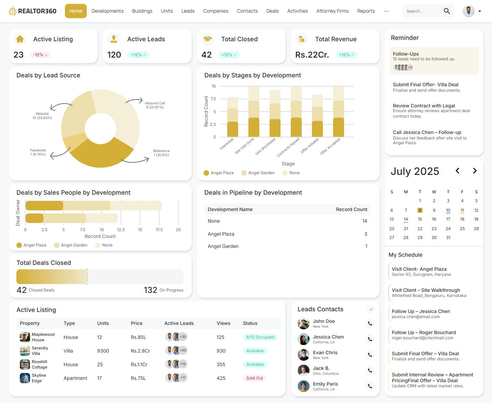
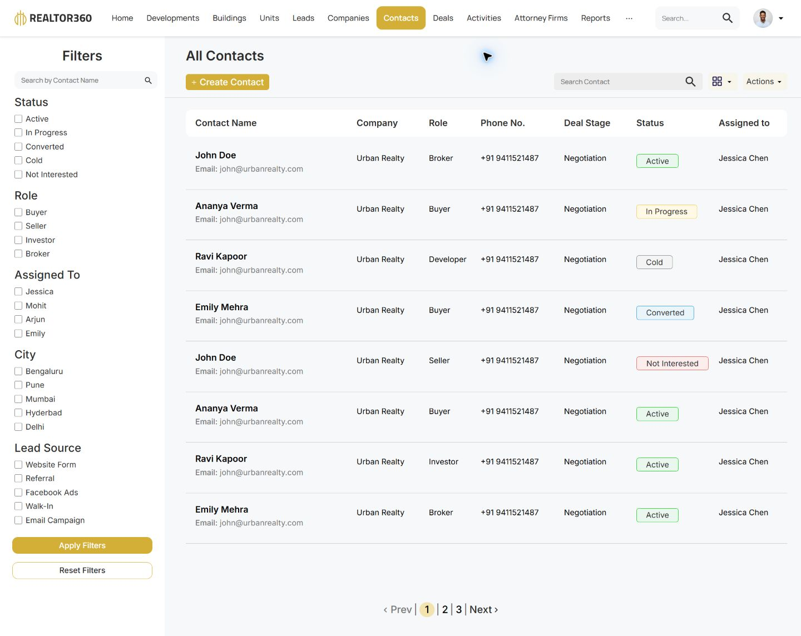

# Realtor360

A responsive React + TypeScript implementation of the Realtor360 **Home and Contacts screens** in the supplied Figma prototype.





## Run locally

Requires Node.js 20.19+ or 22.12+ and npm.

```sh
npm ci
npm run dev
```

Open the URL Vite prints, normally `http://127.0.0.1:5173`.

Use the navigation to switch between Home (`/#/home`) and Contacts (`/#/contacts`). Both routes support direct links and reloads.

```sh
npm run check       # TypeScript validation
npm run verify:assets # Validate SVG assets and their dependencies
npm run build       # TypeScript validation and production build
npm run preview     # Serve the production build locally
npm run format      # Format source and configuration
```

The production output is in `dist/` and can be served by any static web host. Fonts and all design assets are bundled locally; there are no runtime Figma dependencies.

## Design implementation

- Source: [Realtor360, node 2:6286](https://www.figma.com/design/w3ZJn4OeQVLudyC0jOzOYW/Realtor360?node-id=2-6286).
- Desktop reference: **1440 × 1182 pixels**. All 13 cards match the source frame's x/y positions and dimensions at this viewport.
- Contacts source: [node 28:430](https://www.figma.com/design/w3ZJn4OeQVLudyC0jOzOYW/Realtor360?node-id=28-430), **1440 × 1144 pixels**. Sidebar, toolbar, column widths, row boundaries, badges, filters, and pagination follow the exported frame.
- Inter is used for the dashboard; Manrope for navigation. The gold accent is `#D4AF37`, with the original pale chart colors and `#F6F8FA` page background.
- Original SVG logo, metric icons, chart artwork, portrait crops, and property thumbnails are preserved from the view-only Figma export. `public/assets/manifest.json` maps each asset to its source layer and bounds.
- The page uses CSS Grid and Flexbox, semantic HTML tables, live text, and React components. The reference screenshot is not used as the page implementation.
- Smaller screens use a collapsible navigation menu and stacked cards. Wide listing tables scroll inside their card. Responsive arrangements are inferred because only a desktop screen was supplied.

## Working interactions

- Search filters both property listings and contacts, including empty states.
- Property, unit-count, and view-count column headings sort the listing table.
- Property and contact buttons open accessible dialogs; Escape and the close button dismiss them.
- Development legends filter both charts and the pipeline table, with a clear-filter action.
- Calendar arrows change months, including year boundaries. Selecting an event date filters the schedule; **Show all** restores the month overview.
- Reminders can be marked complete and pending. Completion persists in browser local storage and can be reset from the profile menu.
- Navigation opens relevant demo data panels or takes the user to the listing table.
- Contacts provides name and global search, combined checkbox filters, sortable columns, table/card views, detail dialogs, CSV export, pagination, and a validated creation form. Created contacts persist in local browser storage.

## Scope and data

This is a frontend implementation of the requested Home and Contacts screens, not a production CRM backend. Other navigation panels are local demos rather than complete module pages. Contact actions show supplied information; they do not place calls or send messages.

Contacts preserves all eight source records, including repeated names and email addresses. The design shows three page buttons but supplies only eight records, so subsequent pages show an empty state until contacts are added. Source records have no city or lead-source values; those filters apply to explicitly populated records. New contacts are local to the browser and are not sent to a server.

Displayed figures, spelling, July 2025 calendar, and the original unusually long final schedule item are retained from Figma. Unlabelled chart series values used for interactive filtering are illustrative values inferred from the artwork. Source labels are preserved even where the underlying counts and percentages do not reconcile. No production data is fetched.

## Structure

```text
src/App.tsx           Dashboard components and interactions
src/data.ts           Typed listing, contact, schedule, and chart data
src/styles.css        Layout, design tokens, and responsive styles
src/ContactsView.tsx  Contacts screen and interactions
src/contacts-data.ts  Typed contact records and filter options
src/contacts.css      Contacts layout and responsive styles
src/main.tsx          React entry point and bundled fonts
public/assets/        Original Figma assets and provenance manifest
scripts/              Asset extraction and integrity verification
docs/                 Verification notes and rendered screenshots
```

See [verification notes](docs/verification.md) for the checks performed and fidelity limitations.

To reproduce the asset extraction, export both screens from Figma as SVG with **Include id attribute** enabled and **Outline text** disabled. Save them as `design-reference/home.svg` and `design-reference/contacts.svg`. Run `python scripts/extract-figma-assets.py`, followed by `python scripts/extract-contacts-assets.py`. These produce 36 local design assets and their provenance manifest. Reference exports are intentionally excluded from version control.

Design and supplied imagery remain the property of their respective owners. No redistribution license is inferred from access to the reference file.
